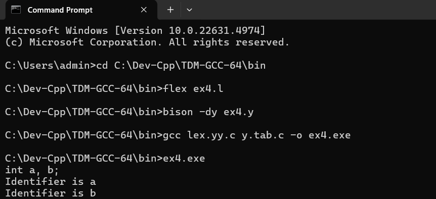

# Ex-4-LETTER-FOLLOWED-BY-ANY-NUMBER-OF-LETTERS-OR-DIGITS-USING-YACC
RECOGNITION OF A VALID VARIABLE WHICH STARTS WITH A LETTER FOLLOWED BY ANY NUMBER OF LETTERS OR DIGITS USING YACC
# Date: 30/4/2025
# Aim:
To write a YACC program to recognize a valid variable which starts with a letter followed by any number of letters or digits.
# ALGORITHM
1.	Start the program.
2.	Write a program in the vi editor and save it with .l extension.
3.	In the lex program, write the translation rules for the keywords int, float and double and for the identifier.
4.	Write a program in the vi editor and save it with .y extension.
5.	Compile the lex program with lex compiler to produce output file as lex.yy.c. eg $ lex filename.l
6.	Compile the yacc program with YACC compiler to produce output file as y.tab.c. eg $ yacc –d arith_id.y
7.	Compile these with the C compiler as gcc lex.yy.c y.tab.c
8.	Enter a statement as input and the valid variables are identified as output.
# PROGRAM
## ex4.l file
```
%{
#include "y.tab.h"
%}

%%
"int" { return INT; }
"float" { return FLOAT; }
"double" { return DOUBLE; }

[a-zA-Z][a-zA-Z0-9]* {
    printf("Identifier is %s\n", yytext);
    return ID;
}

";" { return ';'; }  /* Match semicolon */

[ \t\n]+ ;  /* Skip whitespace */

. { return yytext[0]; }
%%

int yywrap() {
    return 1;
}
```

## ex4.y file 
```
%{
#include <stdio.h>
#include "y.tab.h"  // Include the token definitions generated by Bison

extern int yylex();  // Declare yylex function explicitly
extern void yyerror(char *s);  // Declare yyerror function explicitly
%}

%token ID INT FLOAT DOUBLE

%%

D: T L ';'  /* declaration, followed by a semicolon */
 ;

L: L ',' ID  /* list of identifiers separated by commas */
  | ID       /* or a single identifier */
  ;

T: INT
  | FLOAT
  | DOUBLE
  ;

%%

extern FILE *yyin;

int main() {
    yyparse();
    return 0;
}

void yyerror(char *s) {
    fprintf(stderr, "Error: %s\n", s);
}
```

# Output


# Result
A YACC program to recognize a valid variable which starts with a letter followed by any number of letters or digits is executed successfully and the output is verified.
